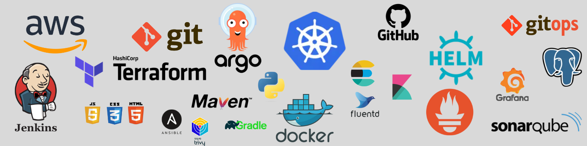
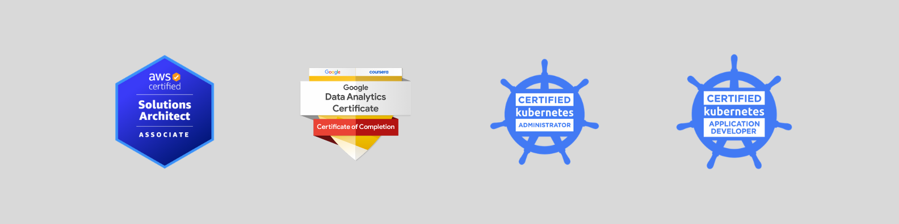

# GitHub Portfolio

## Welcome to my GitHub account! This space is dedicated only to showcasing my projects. Each project is focused on solving a specific task. Feel free to explore my repositories.

**My Toolset:**

**My Certifications:**

**My Projects:**

- **Enterprise_CICD** and **gitops-pipeline**: Implementation of robust, scalable, and secure CI/CD pipeline.
- **Engineering Challenge**: Completing a hands-on DevOps engineering challenge
- **ArgoCD** and **nginx-private-argo**: A Continuous Deployment-focused project
- **GitHub Actions and ArgoCD**: A Continuous Integration-focused project
- **EKS Cluster**: Kubernetes cluster setup with HPA, Cluster Autoscaler, and Cert Manager
- **CSI Driver**: Enabling Kubernetes to manage AWS EBS volumes through PVs and PVCs
- **EFS**: Enabling Kubernetes to manage AWS EFS volumes
- **RDS**: Best practices for provisioning databases, handling secrets, and integrating alerts
- **Lambda**: Rotating secrets in AWS Secrets Manager using AWS Lambda
- **Logging**: Implementing logging with the EFK stack (Elasticsearch, Fluentd, and Kibana)
- **Monitoring**: Implementing monitoring with Prometheus and Grafana
- **VPC**: Terraform modules for reusable code and infrastructure provisioning best practices
- **Slackbot**: Containerizing a Slackbot that listens to events from a Slack channel
- **nmend.dev**: Repository for my website (code only)
- **Certbot**: Managing SSL/TLS certificates with Certbot
- **Sealed Secrets**: Enhancing Infrastructure as Code reusability with Sealed Secrets
- **SpringBoot Docker**: Containerizing a Java application built with SpringBoot and Maven